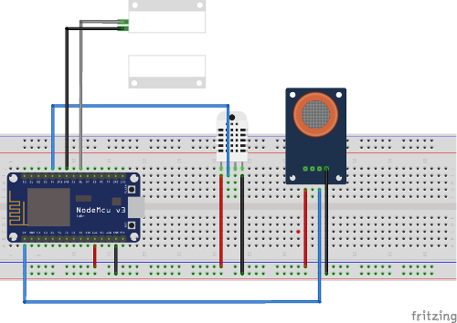

# TFG UNIR Carlos Velasco
## Código Diot Arduino

Esta código pertenece al proyecto Diot Alarma Inteligente.

## Requisitos
* Arduino IDE
* [Arduino Core Esp8266](https://github.com/adafruit/DHT-sensor-library)
* [DHT Adafruit](https://github.com/adafruit/DHT-sensor-library)
* [MQ-2 Sensor library](https://github.com/labay11/MQ-2-sensor-library)
* [Arduino Client for MQTT](https://github.com/knolleary/pubsubclient) 
*[WiFiManager](https://github.com/tzapu/WiFiManager)  

## Instalación
Abrir el archivo en Arduino IDE e instalar las librerías.

Una vez terminada la instalación, cambiar la placa en las herramientas del IDE a **GENERIC ESP8266 MODULE**, compilar y subir el código a la placa